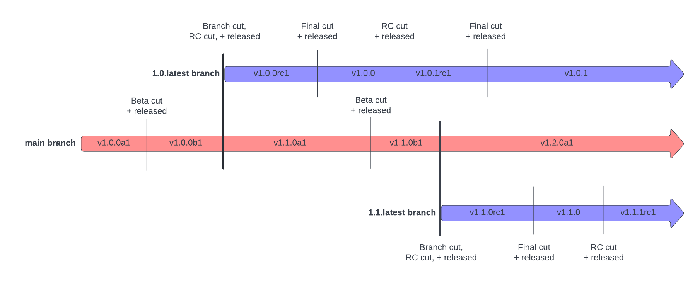

# Release Versioning / Branching Strategy

## Context
With `dbt` ever evolving and progressing, we continue to ship and release versions on a regular basis. As we release `dbt`, versioning and branching become key to identifying what changes for users and conveying the expectations of those changes. We currently push all our changes to `main` which is the latest version of our code. We don't always want to release the latest version of our code though. We want to be able to isolate changes to go into particular releases based on urgency (e.g. bug fixes) and stability (e.g. new features). 

We already have an established versioning strategy when it comes to major/minor/patch releases. The following is our approach as to what to expect from each release version:

* Major: This signifies that breaking changes which require user action are included in this release.
* Minor version: This signifies that new features are included in this release.
* Patch version: This signifies that bug and security fixes are included in this release.

We need a versioning strategy that allows us to to convey to users the confidence and stability of code they are installing. We want a versioning strategy that allows users to try out new changes, and experiment with them to get early feedback. We want to make sure users can also get a preview of new features we are working on, so they can incorporate these changes into their work as soon as possible. 

We need a branching strategy to support the goals of the versioning strategy. We do not want to have to stop development on `main` as we await a release, nor do we want every change in `main` published in every release. Using branches, we can decide which changes go into which release.

## Requirements
The following are requirements that must be met for releasing dbt:

1. We must have major, minor, and patch releases.
1. We must have release types that have the goal of garnering early feedback from the Community.
1. We must have release types that aim to identify bugs and test for stability.
1. We must have release types that are stable and production quality.
1. We must have the ability to isolate changes from different versions based on the type of release.

## Decisions

### Version Types

 Header Explanations: 

- Type: the type of the version (e.g. beta, final)
- Released?: does this type of version need to be released?
- Branches: the branches where these version types are present (e.g. beta version numbers should only exist on the `main` branch)
- Release Versions: the releases where the version type is applicable (i.e. we will only have alphas for major and minor releases, we will not have alphas for patch releases)
- Expectations: the stability of the code changes in the release

| Type | Released? | Branches | Release Versions | Expectations |
| ---- | --------- | -------- | ---------------- | ------------ |
| Alpha | No | `main` | Major / Minor | Experimental |
| Beta | Yes | `main` | Major / Minor | Experimental |
| RC | Yes | Release branch | Major / Minor / Patch | Pre-production |
| Final | Yes | Release branch | Major / Minor / Patch | Production |

### Branching Strategy
Based off of the release version and expectations, the version type's branching strategy can be determined. 
 * Alpha and Beta are experimental and therefore exist on `main` where all our changes reside. 
 * Alpha is never released but instead signifies that development is happening but the changes during that period have never been released in any form.
 * RC is moving to a stable state. Therefore, a release branch will be created for RC releases to start limiting the changes happening for that release.
 * Final is a stable, tested version. Only verified changes will go into this release which is inherited from the RC so a release branch is also required.
 * A release branch will exist for each unique major, minor version release and be named accordingly: `<major>.<minor>.latest` (ex `1.0.latest`)

 

## Status
In Progress

## Consequences
This doesn't drastically change our current versioning and branching strategy but instead documents what we have been doing.

The only major change is we are now incorporating an Alpha version which we previously didn't use at all. The consequences of moving to use an Alpha are to make developing across multiple repos easier. We want `dbt-core` and adapters depend on minor versions. If we don't have a way to keep the `main` branches in sync with one another, then integration tests will start failing. It is also confusing when the `main` branch shows it's an RC or Final version when we do not release the version from there. This gives more clarity as to what versions live where.

## Outside Scope
The following are topics that are outside the scope of this document and will be addressed in their own ADR:
* Hotfixes and their branching strategies
* How and why we bump release versions right before a release.
